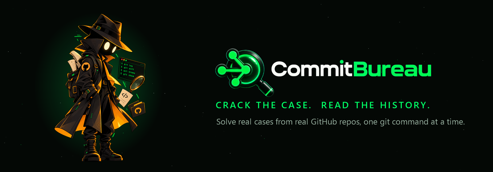

# CommitBureau

<p align="center">
  
</p>

<p align="center">
  
  
  
  
  
  
</p>

**it's a detective game , it uses real GitHub repos, and you solve the cases by typing real Git commands**

<p align="center">
  <a href="https://commitbureau67.vercel.app/"></a>
  <a href="https://devpost.com/software/commitbureau"></a>
</p>

## Why we built it
Git is hard to learn because tutorials teach commands on toy examples, but never show you how to read a real project's history. We wanted a way to practise on the real thing, so CommitBureau turns any public GitHub repo, even the Linux kernel, into detective cases you solve with real Git commands. 

## Features
-   **Detective terminal:**  each case gives you a terminal, and you type commands like  `git log`,  `git show`,  `git blame`-style  `git log -- <file>`,  `git shortlog`  and  `git cat-file`  to find the clues. Some clues are hidden on purpose, such as a scrubbed author.
-   **5 levels:**
    -   1 Rookie: commits
    -   2 Officer: diffs
    -   3 Detective: file history
    -   4 Inspector: merges and PRs
    -   5 Chief: choosing the right command in a Git emergency
-   **Daily Cases:**  3 real repos a day (Easy, Medium, Hard), the same for everyone.
-   **Case Zero:**  a built-in practice repo that works  **offline**, with no token.
-   **My Archive:**  type a GitHub username and investigate  **your own**  old projects.
-   Scoring, streaks, hints that cost points, ranks from Rookie to Chief, and a skills report at the end.

## How It Works
+ **Frontend**: React + Vite
+ **Engine**: plain Javascript in src/engine/
+ **UI**: ui talks engine through src/api.js
+ **Data**: GitHub REST API
+ **Rate-limit handling**: Responses are cached, if limit is hit mid-game , player can provide his own github token or game gets shorter automatically
+ **Terminal**: it doesn't run real Git and doesn't require user to connect his github account. It **imitates** Git's output using the API data, and **masks** the clue the player has to find.
 + **The token proxy:**  a Vercel Function (`api/github.js`) adds a GitHub token  **on the server**, so players get 5,000 requests an hour and the browser never sees the token.
 + **Case Zero**: answers from local data, with no network at all (DEMO)
   
***We're proudest of the investigation terminal, which imitates real Git so players can solve cases in the browser without installing Git, cloning a repo, or connecting their GitHub account. It runs commands like `git log`, `git show` and `git shortlog` against commit data from the GitHub API, prints output in Git's own format, and hides the key clue (such as a commit's author) so it has to be deduced rather than read off***

 ## Technologies
-   React 19, Vite 8, JavaScript
-   GSAP (animations), lucide-react (icons)
-   The GitHub REST API, Vercel (hosting plus a serverless function), oxlint (linting)
-   Google Fonts: Inter, JetBrains Mono, Space Grotesk
-   The Web Audio API (the sound effects are generated in code, with no audio files)


## Setup

### Requirements
- [Node.js](https://nodejs.org/) 22 (LTS) or newer
- Git, to clone the repository

### Run it locally
```bash
git clone https://github.com/ejinbt/CommitBureau.git
cd CommitBureau
npm install
npm run dev
```
Then open http://localhost:5173/ in your browser.

### GitHub token (optional)
Without a token, GitHub allows about 60 API requests an hour, which is roughly 6 games.
For more, create a [fine-grained personal access token](https://github.com/settings/personal-access-tokens/new)
with **Public repositories (read-only)** access and no other permissions, then paste it into the
token field in the game. It is stored only in your browser and sent only to GitHub.
***demo token is already passed to the live site for testing***

**Case Zero**, the built-in practice repo, works with no token and no internet connection.

### Other commands
| Command | What it does |
|---|---|
| `npm run build` | Builds the production site into `dist/` |
| `npm run preview` | Serves the production build locally |
| `npm run lint` | Checks the code with oxlint |

### Deploying
The live site runs on Vercel, with a small serverless function (`api/github.js`) that adds a
server-side GitHub token so players don't need their own. See [docs/DEPLOY.md](docs/DEPLOY.md)
for the steps. Locally, `npm run dev` doesn't run that function, so the game calls GitHub directly.

## Credits

- The assets like spider character and logo is generated using ChatGPT
- React 19, Vite 8, JavaScript
-   GSAP (animations), lucide-react (icons)
-   The GitHub REST API, Vercel (hosting plus a serverless function), oxlint (linting)
-   Google Fonts: Inter, JetBrains Mono, Space Grotesk
-   The Web Audio API (the sound effects are generated in code, with no audio files)

## AI DISCLOSURE
+ we used AI tools like VScode with claude code extension and Antigravity
+ on backend AI designed the levels and in frontend AI designed common things like navbar, icons , animations
+ we ourselves wrote the core-engine of the game , in frontend we placed and installed mascot ourselves and other things like color-schemes, folder theme , navigation , state management
+ we reviewed every changes AI made and gave us our opinions and suggested the fixes 
+ we tested in browser after every prompts , we had a checklist with us

## Team
+ [@ejinbt](https://github.com/ejinbt/) - the game engine , game logic , integration
+ [@AlenJoby](https://github.com/AlenJoby/) - UI , design , state management , routing 

## Challenges and what we learned
 **1. Keeping a secret token safe with no backend**
 Without a token, GitHub allows only 60 requests an hour, which is about 6 games. But our site runs entirely in the browser, so any token we put in the code would be visible to anyone who opened DevTools, and GitHub automatically revokes tokens it finds in public repos. We added a small Vercel serverless function that holds the token on the server and forwards only the three read-only requests the game needs. 
 **Lesson:** a frontend can't keep secrets, so anything secret has to live on a server, even a tiny one.

**2. Merging two people's work in the same files**
 One of us built the game engine and the other the interface, but both of us ended up editing the same files, like `App.jsx` and the case screen. A careless merge could silently drop one person's feature, and once one did conflict when we both rewrote the magnifying-glass cursor. We switched to pull requests, did a trial merge on a scratch branch first, and checked that both sides' features still worked before merging into `main`. 
 **Lesson:** agree on who owns which files, and test a merge before trusting it.

Our spider detective peeks in from the screen edges, but at first it covered buttons on smaller screens, slid off-screen or caused sideways scrolling on phones, and either stayed forever or moved stiffly. We tuned its edge offsets, scaled it with the screen size using clamp(120px, 14vw, 360px), and hid it on screens narrower than 480 px so it never blocks touch controls. For motion, GSAP timelines give it a springy entrance, an automatic retreat after 4.5 seconds, and clean resets with killTweensOf(). 
**Lesson:** a decorative feature still has to respect the layout. Test it on every screen size, not just your own monitor.


## Future works
+ leaderboards
+ a story-mode mystery
+ more git commands (git blame, git bisect)
+ multiplayer race mod
+ private repos
